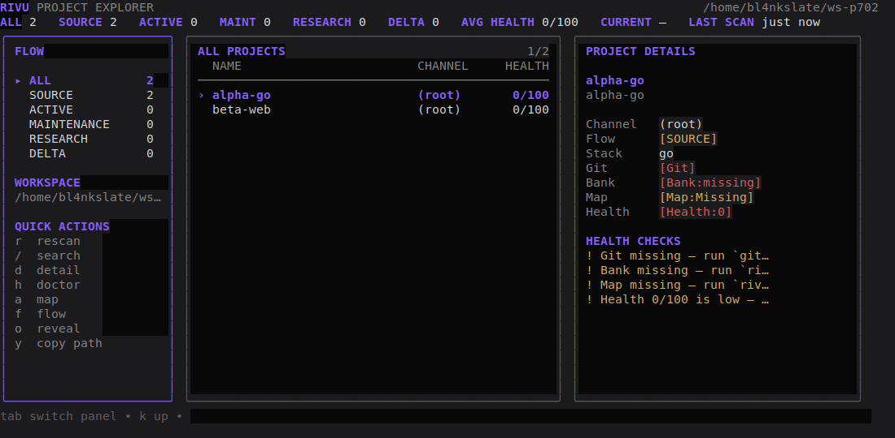

# Rivu

**Your project filesystem, mapped and flowing.**

[](https://github.com/manojpisini/rivu/actions/workflows/ci.yml)
[](LICENSE)
[](https://go.dev/dl/)

Rivu is a cross-platform Go CLI and Bubble Tea TUI that maps your project
folders and keeps them flowing. You point it at a workspace, it scans what is
there into a local SQLite registry, and from then on you create, open, audit
and regroup projects by name — headlessly from scripts or interactively in
the terminal.



## Quickstart (60 seconds)

```bash
git clone https://github.com/manojpisini/rivu.git
cd rivu && go build -o rivu ./cmd/rivu     # 1. build (Go 1.24+)

rivu init --root ~/dev                     # 2. config + database for a workspace
rivu scan                                  # 3. discover what is in there
rivu tui                                   # 4. explore it
```

`rivu tui` opens the three-panel explorer: stages and filters on the left,
the project list in the middle, details on the right. Press `?` for the full
key reference, `:` for the command palette. Without a terminal attached,
`rivu tui` prints the dashboard instead.

## Install

| Platform | Method |
| --- | --- |
| Windows, macOS, Linux | `go install github.com/manojpisini/rivu/cmd/rivu@latest` (requires [Go 1.24+](https://go.dev/dl/)) |
| Windows, macOS, Linux | from source: `git clone https://github.com/manojpisini/rivu.git && cd rivu && go build -o rivu ./cmd/rivu` |

Packaged binaries (scoop, brew, apt) are not published yet — build from
source until the first release tag.

## Vocabulary

Rivu says these words everywhere; they replace the usual folder-and-lifecycle
vocabulary on purpose.

| Term | Means |
| --- | --- |
| **Flow** | the stage a project is in: `source`, `active`, `maintenance`, `research`, `delta` |
| **Source** | creating a new structured project (`rivu source "Name"`) |
| **Channel** | an on-disk path group; a project's Flow stage lives in the registry, not in its folder name |
| **Current** | the project single-target commands act on when none is named (`rivu open` opens Current) |
| **Map** | the generated agent-readable layer: file index, entrypoints, read-first ordering |
| **Bank** | the protected per-project files: `project.toml`, `overview.md`, `decisions.md`, `tasks.md`, plus `agent/` |
| **Delta** | archived, paused indefinitely, or done — a Flow stage and a verb (`rivu delta my-project`) |
| **Confluence** | a named grouping of related projects across Channels — tags, not folders |

## Essential commands

```bash
rivu source "My Project" --flow active --git   # create a structured project
rivu source "Preview" --dry-run                # preview only, writes nothing
rivu open my-project                           # open Current or named project
rivu flow my-project --to maintenance --yes    # move between Flow stages
rivu flow my-project --to maintenance --dry-run
rivu delta my-project --yes                    # park a project for later
rivu doctor my-project                         # health checks with remedies
rivu agent sync my-project                     # build the Map
rivu stats                                     # portfolio metrics
rivu dashboard                                 # dashboard snapshot
rivu path my-project                           # print path only (scripts)
```

Exit codes: `0` ok · `1` error · `2` usage · `3` not found · `4` needs
`--yes` · `5` warnings. Global flags: `--dry-run`, `--yes`, `--json`,
`--no-color`, `--quiet`, `--verbose`, `--home`, `--config`.

## TUI keys

| Keys | Action |
| --- | --- |
| `j` `k` / arrows, `pgup` `pgdn`, `ctrl+u` `ctrl+d`, `G`, `home` `end` | move in the list |
| `tab` / `left` `right` | switch panel |
| `enter` | open (Current or the selected row) |
| `/` `esc` | search / clear |
| `space` | pick (multi-select) |
| `d` `h` `a` `f` `A` | detail · doctor · Map report · flow · delta |
| `x` | actions menu |
| `y` `o` | copy path · reveal in file manager |
| `1`-`5`, `u`, `n` | jump to stage · untriaged · source filter |
| `g` or `m` | Master Dashboard |
| `s` `S` `L` `c` | stats · settings · logs · confluences |
| `:` `?` `q` | command palette · help · quit |

Mouse is optional and never required: the wheel scrolls, a click selects, a
double-click opens.

## Configuration

Config file: `~/.rivu/config.toml` (Windows: `%USERPROFILE%\.rivu`).
`RIVU_HOME` / `--home` relocates config + database; `RIVU_CONFIG` / `--config`
points at a specific file.

```bash
rivu config show         # every effective value
rivu config get scanner.max_depth
rivu config set appearance.theme mono
rivu config validate     # check config, values and workspace root
```

The knobs worth knowing:

| Key | Default | Effect |
| --- | --- | --- |
| `workspace.root` | `~/Projects` | what `rivu scan` walks |
| `workspace.secondary_roots` | — | extra roots to scan |
| `scanner.max_depth` | `6` | how deep scanning goes |
| `scanner.ignore` | `node_modules`, `.git`, … | never-descend names |
| `flow.stale_threshold_days` | `45` | when doctor flags a project stale |
| `flow.source_sla_days` | `14` | how long `source` may sit untriaged |
| `health.weights` | readme 20, git 15, bank 15, map 15, … | how health is scored |
| `editors.default` | `code` (Windows) / `${EDITOR}` | what `rivu open` launches |
| `appearance.theme` | `graphite-violet` | also `mono`, `light` |

## Safety

- **Nothing in Rivu deletes a project folder — ever.**
- Every mutating command is Plan → confirm → Apply: preview with
  `--dry-run`, apply with `--yes`. Non-interactive runs without `--yes`
  exit `4` instead of guessing.
- Bank files are create-if-missing; Rivu never silently overwrites existing
  content, and machine-owned files are rewritten only by parse-and-encode.
- Secret files (`.env*`, `*.pem`, `id_rsa*`, `*.key`) are listed by name in
  the Map — their contents are never read or printed.
- The registry is truth, the filesystem is discovery: re-scanning never
  overwrites health, name, Flow stage or creation time.

## Shell integration

`rivu path` prints nothing but the path, so a wrapper function can jump
straight to a project:

```bash
rcd() { cd "$(rivu path "$@")"; }   # then: rcd my-project
```

## FAQ

**Where does my data live?**
Config and `rivu.db` under `~/.rivu/` (relocate with `RIVU_HOME`). Projects
stay wherever they are; Bank files live inside each project under
`.metadata/`.

**Will Rivu ever delete my projects?**
No. Nothing in Rivu deletes a project folder. Moves and other mutations show
a dry-run first and need `--yes` to apply.

**Why did `rivu scan` exit 5?**
Exit `5` means "completed with warnings" (for example a workspace on
`/mnt/c`, weak markers, or skipped secondary roots) — the warnings say what
to do. Mismatches are reported on stdout and are not failures.

**Registry or filesystem — which wins?**
The registry is truth for Flow stage, name and health; the scan discovers
what is on disk and reconciles without clobbering registry-owned fields.

**Scans feel slow in WSL under `/mnt/c`.**
Expected: DrvFs mounts scan slowly and renames can cross filesystems. Keep
projects on the Linux filesystem (`~/`) when you can; Rivu warns about it.

**I messed up a move. How do I get back?**
Preview every mutation with `--dry-run` first; back up the registry any time
with `rivu db export`, restore with `rivu db import`.

**Colours look wrong / I want plain output.**
Use `--no-color` or `NO_COLOR=1`, pick `mono` or `light` via
`appearance.theme`, or run without a TTY for plain fallback output.

## Development

```bash
go build ./cmd/rivu
go test ./...
go vet ./... && gofmt -l .    # must print nothing
go test -race ./...           # linux/macos
```

## License

MIT — see [LICENSE](LICENSE).
